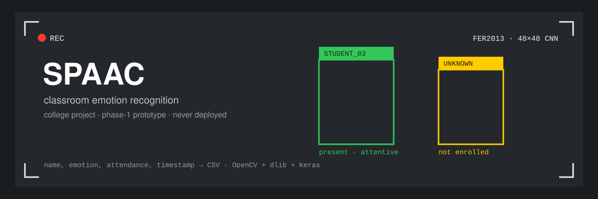

<div align="center">



</div>

A webcam pipeline that identifies known students by face, reads their expression frame by frame, and logs name, emotion, and an attendance flag to CSV. College project, phase-1 prototype.

The pitch: a teacher can't watch every student at once, so use the existing camera feed to flag who's present and who looks disengaged. Academic proof of concept, never deployed.

## What it does

For every detected face: match against 7 enrolled students (one photo each in `images/`), crop it, run it through a Keras CNN trained on FER2013, draw a labelled box, and append a CSV row with name, emotion probability, emotion mode over recent frames, attendance, and timestamp.

## Run

Both entry points live in `SPAAC/` and must be run from inside it, since paths are relative.

```bash
cd SPAAC
python face-rec-emotion.py     # recognition + emotion + CSV logging
python emotions.py             # emotion only, no identity, no CSV
```

`q` quits. Flip `USE_WEBCAM` at the top of either script to read `./test/testvdo.mp4` instead of the camera.

No `requirements.txt`:

```bash
pip install opencv-python dlib face_recognition keras tensorflow imutils numpy pandas matplotlib scipy
```

`dlib` needs CMake and a C++ toolchain, which is the part that usually hurts.

## Enrolling faces

`face-rec-emotion.py` hardcodes the roster near the top, one `load_image_file(...)` per student into `known_face_encodings` and `known_face_names`. Edit those lists and drop matching JPGs in `images/`. Unmatched faces render as `UNKNOWN`.

## Known broken bits

Old prototype code, and it shows:

- **The CSV path is hardcoded to a Windows machine** (`C:\Users\admin\PycharmProjects\SPAAC\file.csv`). `df.to_csv(...)` fails anywhere else. Change it first.
- **The label map doesn't match the emotion strings.** `get_labels("fer2013")` returns `"Attentive"` and `"NOT ATTENTIVE"`, but both scripts branch on `"ANGRY"`, `"HAPPY"`, `"SAD"`. Those comparisons never hit, so box color always falls through to the default and the color logic is effectively dead. Restore the standard FER2013 label map to get named emotions on screen.
- `datasets.py` calls `pandas.get_dummies(...).as_matrix()`, removed in modern pandas, so the FER2013 loader needs an old version.
- Recognition runs on a half-scale frame, but some drawing code assumes quarter-scale. Leftover from the original source.

## Layout

```
SPAAC/
  face-rec-emotion.py   recognition + emotion + logging
  emotions.py           emotion-only demo
  models/               emotion_model.hdf5 (48x48 grayscale mini-CNN)
  images/               enrolled student photos
  test/                 sample videos, report PDF
  utils/                datasets, inference, preprocessing, grad-cam
```

`utils/grad_cam.py`, `visualizer.py`, and `data_augmentation.py` aren't wired into either entry script.

## Credit and scope

The model and much of `utils/` are adapted from oarriaga's open-source face-classification work. The classroom and attendance layer on top is this project's own.

Student project, not tuned, benchmarked, or hardened. Treat it as a learning exercise in stitching face recognition and a CNN classifier into one OpenCV loop.

---

<sub>More from [sudhanshu1402](https://github.com/sudhanshu1402): [keel](https://github.com/sudhanshu1402/keel) · [nocap](https://github.com/sudhanshu1402/nocap) · [receipts](https://github.com/sudhanshu1402/receipts) · [enterprise-auth-stack](https://github.com/sudhanshu1402/enterprise-auth-stack) · [distributed-queue-engine](https://github.com/sudhanshu1402/distributed-queue-engine) · [multi-region-mongo-patterns](https://github.com/sudhanshu1402/multi-region-mongo-patterns) · [otel-sdk-node](https://github.com/sudhanshu1402/otel-sdk-node) · [llm-assessment-pipeline](https://github.com/sudhanshu1402/llm-assessment-pipeline) · [system-design-portal](https://github.com/sudhanshu1402/system-design-portal). Portfolio: [sudhanshu1402.github.io](https://sudhanshu1402.github.io).</sub>

## License

MIT
